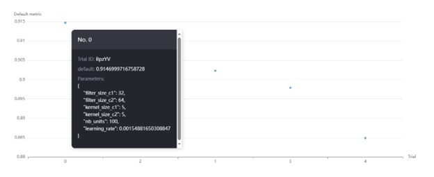

# Application of NAS to Classification Problem

(*The data used in the experiment are specially selected for computational convenience and understanding of the experiment.*)

## Overview

This project focuses on searching for an optimal neural network architecture for classifying fashion products into 10 categories. The dataset used for training and evaluation is **Fashion-MNIST**, which consists of **70,000 grayscale images** (28x28 pixels) with corresponding labels from 10 categories.

The training pipeline is optimized using **Neural Architecture Search (NAS)**.

**Detailed** documentation of this work can be found in the 'Application of NAS to classification problem - documentation(Eng).docx' in this repository (or in the 'Application of NAS to classification problem - documentation.docx' for the greek version).

---

## Dataset

- **Fashion-MNIST** dataset is used, containing:
  - 70,000 images (28x28 grayscale)
  - 10 different fashion categories

---

## Model Training Pipeline

The model training process and architecture details can be found in the `NAS.py` file in this repository.

---

## Neural Architecture Search (NAS)

### Defining the Search Space
To find a better architecture, a search space is defined containing multiple possible configurations.

### Running NAS Experiment

The NAS experiment is run using Neural Network Intelligence (NNI). More details can be found in the `NAS.py` file.

### Results

Below is an image showcasing the experiment results:

After running NAS, the best architecture achieves an accuracy of **~91.4%**, which is an improvement over the manually designed model.

---

## Bibliography
- [YouTube Lecture](https://www.youtube.com/watch?v=td820ts6gUU&t=3687s)

---

## Conclusion
Using **Neural Architecture Search (NAS)** with **Neural Network Intelligence (NNI)**, we achieved a higher accuracy in classification compared to a manually designed architecture. The automated search process efficiently explored different model configurations to find the best-performing one.
